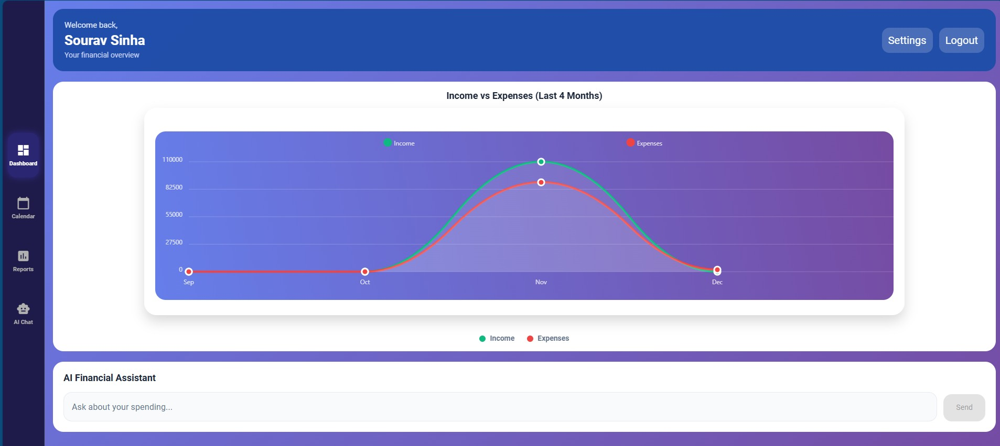

# Expense Advisor 💰

AI-powered personal expense tracking application with web and mobile support. Track your daily expenses, get AI-powered financial insights, and manage your budget intelligently.

## 🚀 Features

- **User Authentication**: Secure signup/login with email verification
- **Profile Management**: Complete profile setup with financial preferences
- **Expense Tracking**: Add daily income and expenses with calendar view
- **AI Assistant**: Chat with AI for financial advice and insights
- **Smart Reports**: Generate PDF/Excel reports with custom date ranges
- **Interactive Charts**: Visualize your financial data with charts
- **Automated Notifications**: Monthly reports and daily reminders
- **Cross-Platform**: Web and mobile app support

## 🛠️ Tech Stack

- **Backend**: Python, FastAPI, PostgreSQL, SQLAlchemy
- **Frontend**: React Native (Web & Mobile), Expo
- **AI**: Ollama (Local LLM)
- **Scheduler**: APScheduler (Background Tasks)
- **Email**: SMTP (Notifications)
- **DevOps**: Docker, Docker Compose
- **Database**: PostgreSQL

## 📱 Screenshots





## 🏗️ Architecture

```
┌─────────────────┐    ┌─────────────────┐    ┌─────────────────┐
│   React Native  │    │     FastAPI     │    │   PostgreSQL    │
│   (Web/Mobile)  │◄──►│    Backend      │◄──►│    Database     │
└─────────────────┘    └─────────────────┘    └─────────────────┘
                              │
                              ▼
                       ┌─────────────────┐
                       │  APScheduler    │
                       │ (Email/Alerts)  │
                       └─────────────────┘
                              │
                              ▼
                       ┌─────────────────┐
                       │     Ollama      │
                       │   (AI Agent)    │
                       └─────────────────┘
```

## 🚀 Quick Start

### Prerequisites
- Docker and Docker Compose
- Node.js 18+ (for local development)
- Python 3.11+ (for local development)

### Using Docker (Recommended)

```bash
# Clone the repository
git clone <your-repo-url>
cd expense_advisor

# Copy environment file
cp backend/.env.example backend/.env

# Start all services
docker-compose up -d

# Initialize database
docker-compose exec backend alembic upgrade head

# Setup AI model
docker-compose exec ollama ollama pull llama3:latest

# Access the application
# Web: http://localhost:3000
# API: http://localhost:8000
# API Docs: http://localhost:8000/docs
```

## 📖 Documentation

- [Local Setup Guide](LOCAL_SETUP.md)
- [Deployment Guide](DEPLOYMENT_GUIDE.md)
- [Project Summary](PROJECT_SUMMARY.md)
- [API Documentation](http://localhost:8000/docs) (when running)

## 🔧 Development

### Backend Development
```bash
cd backend
python -m venv venv
source venv/bin/activate  # Windows: venv\Scripts\activate
pip install -r requirements.txt
uvicorn app.main:app --reload
```

### Frontend Development
```bash
cd frontend
npm install
npm start  # or npm run web for web development
```

## 📊 Key Functionalities

### User Management
- Email-based signup and authentication
- Complete profile setup with financial preferences
- Monthly cycle configuration
- Notification preferences

### Expense Management
- Calendar-based expense entry
- Credit/Debit transaction tracking
- Monthly statistics and summaries
- Search and filter capabilities

### AI Features
- Natural language financial queries
- Automated chart generation
- Personalized financial advice
- Expense pattern analysis

### Reporting
- PDF and Excel report generation
- Custom date range selection
- Transaction type filtering
- Automated monthly email reports

### Notifications
- Daily expense reminders via email
- Monthly report emails with CSV attachments
- Background task scheduling
- Configurable notification times

## 🔐 Security Features

- JWT-based authentication
- Password hashing with bcrypt
- Input validation and sanitization
- CORS protection
- Environment-based configuration

## 🌐 API Endpoints

### Authentication
- `POST /api/auth/signup` - User registration
- `POST /api/auth/login` - User login

### User Management
- `GET /api/users/profile` - Get user profile
- `PUT /api/users/profile` - Update user profile

### Expenses
- `POST /api/expenses/` - Create expense
- `GET /api/expenses/` - Get expenses by month
- `GET /api/expenses/monthly-stats` - Get monthly statistics
- `GET /api/expenses/dashboard-stats` - Get dashboard data

### Reports
- `GET /api/reports/pdf` - Generate PDF report
- `GET /api/reports/excel` - Generate Excel report

### AI Chat
- `POST /api/ai/chat` - Chat with AI assistant

### Notifications
- `POST /api/notifications/test-monthly-report` - Test monthly report
- `POST /api/notifications/test-daily-reminder` - Test daily reminder

## 🤝 Contributing

1. Fork the repository
2. Create a feature branch (`git checkout -b feature/amazing-feature`)
3. Commit your changes (`git commit -m 'Add some amazing feature'`)
4. Push to the branch (`git push origin feature/amazing-feature`)
5. Open a Pull Request

## 📄 License

This project is licensed under the MIT License - see the [LICENSE](LICENSE) file for details.

## 🙏 Acknowledgments

- FastAPI for the excellent web framework
- React Native for cross-platform development
- Ollama for local AI capabilities
- PostgreSQL for reliable data storage

## 📞 Support

For support, email support@expenseadvisor.com or create an issue in this repository.

---

**Made with ❤️ for better financial management**
